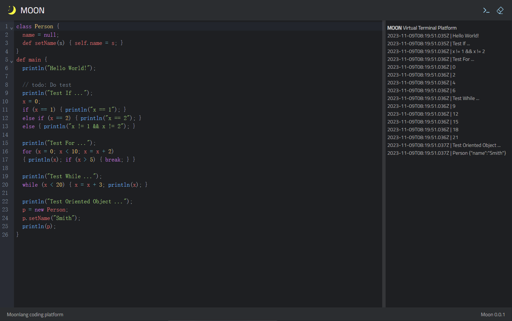

# Moon


moonlang is the newest version of original lealang.

## MoonTypeScript

Moon Run on Browser.

The embedded MoonLang runtime written by TypeScript.



## 语言介绍

特性：

- 语法简单，写法跟主流语言保持一致，学习成本极低；
- 可嵌入，可扩展，可嵌入到任意产品中，通过扩展内建函数，即可实现不同语言环境间的交互。

## 基础语法

变量的声明和定义

```javascript
a = null;
```

多个语句使用分号分隔

## 程序流

### 条件语句

> 注意：在moonlang中，所有程序流控制块的语句，都必须包含在大括号中。不存在单行语句替代大括号语句块的情况。

if条件语句

```javascript
if (x) { /** todo: */ }
if (x) {  } else if (y) {  } 
if (x) {  } else if (y) {  } else {  }
```

### 循环语句

while循环

```javascript
while (i < 10) {
    i = i + 1;
}
```

for循环

```javascript
for (i = 0; i < 10; i = i + 1) {
    
}
```

break和continue语句

## 运算符

### 算数运算符

| 运算符 | 描述   | 用例    |
|-----|------|-------|
| +   | 加法   | 1 + 1 |
| -   | 减法   | 1 - 1 |
| *   | 乘法   | 1 * 2 |
| /   | 除法   | 3 / 2 |
| %   | 整数求余 | 3 / 2 |

### 位运算符

| 运算符  | 描述  | 用例               |
|------|-----|------------------|
| &    | 按位与 | 0b0101 & 0b0001  |
| \|   | 按位或 | 0b0101 \| 0b0001 |
| ^    | 异或  | 0b0101 ^ 0b0001  |
| ~    | 取反  | ~0b0101          |

### 关系运算符

| 运算符  | 描述   | 用例              |
|------|------|-----------------|
| ==   | 相等   | 1 == 1          |
| !=   | 不等   | 1 != 2          |
| \>   | 大于   | 2 > 1           |
| \>=  | 大于等于 | 2 >= 1          |
| <    | 小于   | 2 < 3           |
| <=   | 小于等于 | 2 <= 3          |
| &&   | 逻辑与  | true && true    |
| \|\| | 逻辑或  | true \|\| false |
| !    | 非    | !true           |

## 函数

函数使用def关键字定义

```javascript
def add(a, b) {
    return a + b;
}
```

## 类型系统

### 基础类型

基础数据类型可分为number, boolean

### 引用类型

- null代码空指针

- string

- class定义的类型

## 面向对象

类的声明

```javascript
class Person {
    // 成员变量直接在类中声明即可
    name = null;
    // 方法同函数定义相同
    def getName() {
        // self即this指针
        return self.name;
    }
}
```

对象实例的创建

```javascript
smith = new Person();
```

## 作用域

变量作用域由代码块分隔，一般可分为：全局作用域，函数作用域，块级作用域，class作用域。

## 内建函数

```txt
// 用于打印
def println(...);
```
